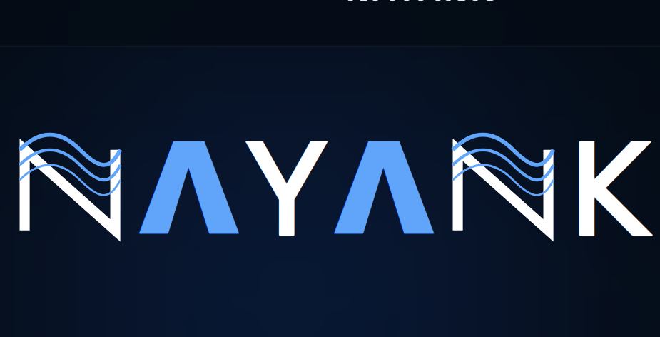

<p align="center">
  
</p>

<h1 align="center">NAYANK</h1>

<p align="center">
<b>AI-Powered Investigation Intelligence Platform</b><br>
Transforming Digital Investigations with Artificial Intelligence
</p>

<p align="center">


</p>

---

# 🚔 About NAYANK

NAYANK is an AI-powered digital investigation platform designed to modernize law enforcement workflows by transforming raw multimedia evidence into structured intelligence.

The platform enables investigators, supervisors, administrators, and citizens to collaborate securely through one intelligent ecosystem.

Instead of manually reviewing thousands of files, officers simply upload evidence and NAYANK automatically analyzes, summarizes, classifies, and generates investigation-ready reports.

---

# 🎯 Problem Statement

Modern investigations involve huge volumes of:

- Images
- Videos
- Audio recordings
- Documents
- CCTV Footage
- Witness Statements

Investigators spend countless hours manually reviewing evidence, preparing reports, identifying suspects, and managing cases.

NAYANK automates this entire workflow using Artificial Intelligence.

---

# 🚀 Key Features

## 👤 Citizen Portal

- File complaints online
- Upload multimedia evidence
- Track complaint status
- Receive investigation updates
- Secure authentication

---

## 👮 Officer Portal

- AI Investigation Dashboard
- Case Assignment
- Evidence Manager
- Timeline Tracking
- AI Investigation Assistant
- Automated Reports
- Task Management
- Behavioral Analysis
- Risk Assessment

---

## 🛡 Supervisor Portal

- Live Monitoring
- Officer Performance
- Case Analytics
- Investigation Reports
- Crime Heatmaps
- High Risk Alerts
- Resource Allocation

---

## ⚙ Admin Portal

- User Management
- Officer Management
- Supervisor Management
- System Analytics
- Audit Logs
- Security Monitoring
- Platform Configuration

---

# 🤖 AI Capabilities

NAYANK includes multiple AI modules.

### 🎤 Speech Intelligence

- Audio Transcription
- Speaker Detection
- Speech Summarization

---

### 📷 Computer Vision

- Image Analysis
- Object Detection
- Scene Understanding
- Evidence Classification

---

### 🎥 Video Intelligence

- Frame Extraction
- Timeline Analysis
- Event Detection
- Motion Understanding

---

### 📄 Document Intelligence

- OCR
- Document Classification
- Report Generation

---

### 🧠 Investigation Intelligence

- Behavioral Analysis
- Risk Scoring
- AI Recommendations
- Investigation Timeline
- Automated Report Writing

---

# 🏗 Architecture

```
Citizen
        │
        ▼
Frontend (Next.js)

        │

Backend (NestJS)

        │

AI Engine (FastAPI)

        │

PostgreSQL Database

        │

Cloudinary Storage
```

---

# 🛠 Tech Stack

## Frontend

- Next.js
- React
- TypeScript
- Tailwind CSS

## Backend

- NestJS
- Prisma ORM
- REST APIs

## AI Engine

- FastAPI
- Faster Whisper
- HuggingFace Transformers
- OCR
- OpenAI Compatible Models

## Database

- PostgreSQL
- Prisma

## Storage

- Cloudinary

---

# 📂 Project Structure

```
NAYANK/

├── frontend/
│   ├── src/
│   ├── components/
│   ├── modules/
│   └── app/
│
├── backend/
│   ├── src/
│   ├── prisma/
│   ├── ai/
│   └── uploads/
│
├── assets/
├── README.md
```

---

# 🔐 Security Features

- JWT Authentication
- Role Based Access Control (RBAC)
- Secure File Upload
- Audit Logging
- Encrypted APIs
- Protected Routes

---

# 👥 User Roles

- Citizen
- Investigation Officer
- Supervisor
- Administrator

---

# 📈 Future Enhancements

- Face Recognition
- Automatic Number Plate Recognition (ANPR)
- Crime Prediction
- GIS Crime Mapping
- Drone Feed Analysis
- CCTV Live Analytics
- Mobile Officer App
- Multilingual AI Assistant

---

# ⚡ Installation

## Clone Repository

```bash
git clone https://github.com/PURNIMA-SIRANGU/NAYANK.git
```

---

## Frontend

```bash
cd frontend
npm install
npm run dev
```

---

## Backend

```bash
cd backend
npm install
npm run start:dev
```

---

## AI Engine

```bash
cd ai
pip install -r requirements.txt
uvicorn main:app --reload
```

---

# 🌐 Environment Variables

### Frontend

```
NEXT_PUBLIC_API_URL=
NEXT_PUBLIC_AI_URL=
```

### Backend

```
DATABASE_URL=
JWT_SECRET=
CLOUDINARY_URL=
```


# 👨‍💻 Developers

### 👩 Sirangu Purnima

**Role**

- AI Development
- Backend Development
- Database Design
- System Architecture
- AI Integration
- API Development
- Documentation

---

### 👨 Maladi Pavan Teja

**Role**

- Frontend Development
- UI/UX Design
- Dashboard Development
- Responsive Design
- React Components
- Next.js Integration

---

# 🏆 Project Vision

Our vision is to empower law enforcement agencies with intelligent investigation tools that reduce manual effort, accelerate case resolution, and enhance public safety through Artificial Intelligence.

---

# 📜 License

This project is developed for research, innovation, and hackathon purposes.

---

<p align="center">

⭐ If you like this project, don't forget to star the repository!

Made with ❤️ by Team NAYANK

</p>
